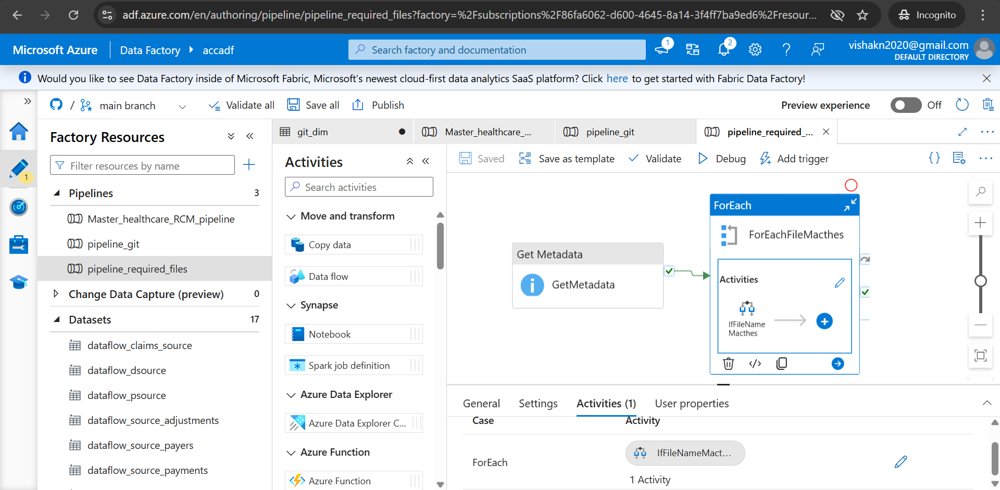

# Healthcare AR management using Azure Data Factory

This Azure Data Factory (ADF) project focuses on processing and transforming data from the Healthcare Accounts Receivable (AR) domain to support better business evaluation and decision-making.

## Project Description:

In the Healthcare, **Account Receivable** (amount owed by patients or insurance company) should be managed properly. If there is any delay or uncollectible amount will affect the cash flow of the management. 

Thus, this project helps in understanding the data and helps the business stakeholders to take actions for the better cash flow, such as 

- Total bill
- Adjustment amount
- Amount paid
- Remaining amount in the AR

These data helps us to analyse the business even more in wide view and take better action for the good cash flow and reduce the collection period.

Action could be done:-
- **regular follow-ups**
- **automated remainders**

## 🧰 Tech Stack

- **Azure Data Factory (ADF)** – for building pipelines and orchestration 
- **Azure Data Lake Storage** – Used for storage purpose 
- **Mapping Data Flows** – to transform the data as per business requirements  
- **GitHub** – Integrated with ADF for version control, collaboration, and as a source location

## 🚀 Getting Started
Steps to get started with the project

### Step 1: 📁 Create Required Containers in Azure Data Lake
Create the storage account with namespace heirarchy checkbox ticked to create the Azure Data lake or Azure blob stoarge can also be used, In the ADLS create the containers such as 

- `staging` – for raw source files 
- `staging` – here files will be coming from raw container with some condition and also from the git source 
- `final` – files from the staging will be joined, trasmformed and loaded in the final container

### Step 2: 🔗 Create Linked Services in ADF
- Azure Data Lake Storage – to connect with your blob containers
- GitHub – to get data from the gitHub using http source

### Step 3: 🛠 Create Datasets
Create the dataset whenever needed while creating a pipeline
- dataset - file which is used for processing 

## 🛠 Step 4: Create Pipelines:

### Pipeline Git
Creating a pipeline with copy activity to get the data from the github and loading into the staging container.
**Note:** create and use the appropriate source and sink dataset here

### Pipeline required Files
* Create a pipeline with metadata activity from which getting the childitems of the each file
* Each file will be scan by the ForEach Activity based on the childItems
  **@activity('GetMetadata').output.childItems**
* Using the If Condition Activity pass a condition on each file, if it satisfy copy and load into the staging layer along with the git source file
  **@startswith(item().name,'Fact')**

**Note:** create and use the appropriate dataset here, also define the parameter in source and sink file , Also, define parameters in both the source and sink datasets to dynamically handle file names, using the item().name from the  **@activity('GetMetadata').output.childItems**

### Step 5: 🔄 Build Mapping Data Flows
- Extracting all the necessary files from the stage container
- Aggregate operation on fact_adjustment, fact_payments
- Joining the fact_claims with the fact_adjustment, fact_payments and dim_payers
- Using the derived column operation to get the receivable amount from the patient or insurers.
- **receivable_amount = total_charge + total_adjustment - total_paid**

### Step 6: Delete Activity
After processing Delete the data from the staging layer, so everytime the data get processed as new.

## Step 7: Master pipeline using Executive Pipeline activity 
- Creating a pipeline combining both pipelines, dataflow and delete activity altogether as master pipeline.

## ▶️ Usage

Once everything has setup

1.**Triggering the pipeline**
   - Running the pipeline manually or run it with any of the trigger
     
2. **Master Pipeline flow**
   - once the pipeline triggered, pipeline Git get executed and load the file from the git to Stage Container.
   - After that pipeline required files will do the work and load the respective files based on the condition.
   - Then the data Flow starts, do the tranformation and load the data into the final container.
   - Finally, Delete Activity will remove the files from the Staging Container after the Data Flow gets done.

3. **Monitor Pipeline Execution**
   - Use the **Monitor** tab in ADF to track runs and debug any failures.

4. **Verify Output**
   - Final transformed data will be available in the `final` container in Azure Data Lake.
   - Use this data for reporting, analysis, or dashboarding.

